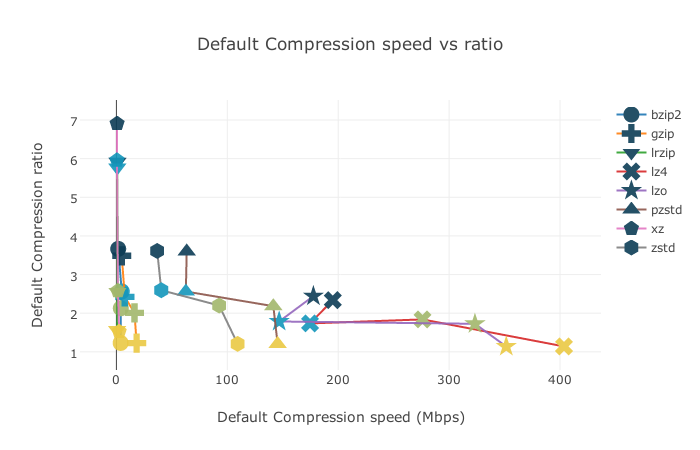

###########################
Compression tools benchmark
###########################

Personal interpretation
#######################

xz
    For highest compression ratio at cost of speed
lz4
    For the fastest, costing speed
(p)zstd
    For everything in the middle

Files
#####

41MB -- etc_files.tar
    All files on my /etc filesystem
13MB -- mix_pdf_jpg.tar
    A mix of pdf & jpg documents (hard to compress)
94MB -- robot.blend
    Some uncompressed .blend file
80MB -- usr_bin_xstar.tar
    Tarball of /usr/bin/x* filesystem

Results
#######

Do it yourself
##############

- Install plotly for Python
- Copy your archives or files to ``files``
- run ``./run``
